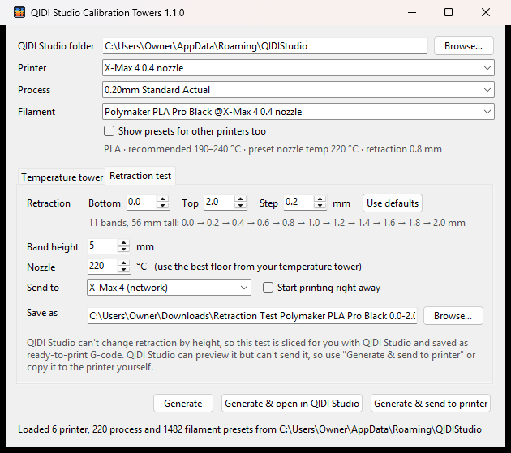
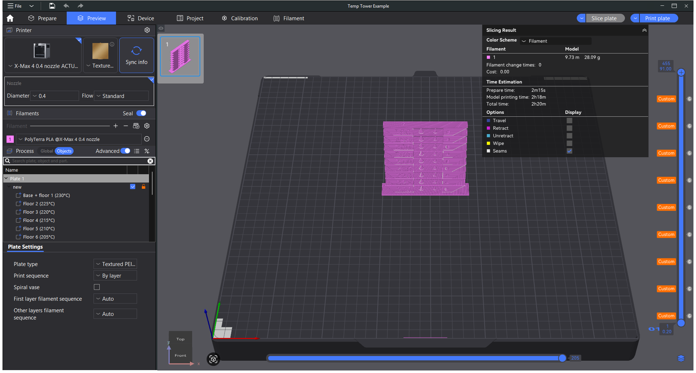

# QIDI Studio Temperature Tower Generator

QIDI Studio doesn't have a temperature tower calibration. This tool makes one: it reads your printers, filaments and process presets from QIDI Studio and writes a ready-to-slice `.3mf` project. Each floor of the tower prints at a different nozzle temperature, with the temperature engraved on the front.





## Features

- **Uses your own presets.** It lists the printers, processes and filaments you have in QIDI Studio, including your custom ones, and only shows presets that work with the chosen printer.
- **Sensible defaults.** The temperature range comes from the filament's recommended range, hottest at the bottom, in 5 °C steps. It warns you if the tower won't fit under your printer's height limit.
- **Opens ready to slice.** The selected presets are embedded in the project, so QIDI Studio opens it with that printer, process and filament selected. Supports are turned off for the tower.
- **Temperature changes you can see.** Each change is a custom G-code marker on QIDI Studio's layer slider (`M104 S…`, or `M109` if you'd rather the printer wait at each change).
- **Download and run.** Ready-made apps for Windows, macOS and Linux are on the Releases page, or you can run it from source with plain Python 3. There's a window and a command line.

## The tower

The base is 1 mm thick, and there's one 10 mm floor per temperature. Each floor tests:

| Feature | What to look for |
|---|---|
| Engraved temperature on the front block | Which floor you're looking at |
| 45° overhang (left) and 35° overhang (right) | Drooping or curling on the underside |
| 30 mm bridge | Sagging strands |
| Two cones between the pillars | Stringing and blobs from travel moves |
| Vertical 3 mm hole and horizontal 4 mm hole | Round, clean holes |

Pick the floor that looks best overall. Hotter usually means better layer bonding, glossier walls and more stringing. Cooler means cleaner overhangs and bridges.

The geometry is generated in code (`tower_geometry.py`). It's an original design in the spirit of the classic "all-in-one" temperature towers.

## Download

Get the latest version from the [Releases page](https://github.com/SlamJammington/qidi-temp-tower/releases/latest):

| System | File | How to start it |
|---|---|---|
| Windows 10/11 | `QidiTempTower-windows.exe` | Double-click it. Nothing to install. |
| macOS (Apple silicon) | `QidiTempTower-macos.zip` | Unzip, then right-click **QidiTempTower** → **Open** the first time. |
| Linux (x86-64) | `QidiTempTower-linux.tar.gz` | Extract, then run `./QidiTempTower`. |

The apps aren't code-signed, which costs money every year, so your system will warn you the first time:

- **Windows** shows "Windows protected your PC". Click **More info**, then **Run anyway**.
- **macOS** says the app is from an unidentified developer. Right-click → **Open** gets past it.

GitHub Actions builds every release file from the source in this repository; nobody builds them on a personal machine. Each release lists SHA-256 checksums. With the [GitHub CLI](https://cli.github.com/) you can also check where a file came from:

```bash
gh attestation verify QidiTempTower-windows.exe --repo SlamJammington/qidi-temp-tower
```

That confirms the file was built by this repository's release workflow, and from which commit.

## Use

Pick a printer, process and filament, check the temperatures, then click **Generate** or **Generate & open in QIDI Studio**.

### Command line

The same program works from a terminal. Use the downloaded app's name, or `python3 qidi_temp_tower.py` from source:

```bash
QidiTempTower --list filament
QidiTempTower --filament "Generic PLA @Qidi X-Max 4 0.4 nozzle" --start 230 --end 190 --step 5 --open
QidiTempTower --help
```

Any preset you don't specify defaults to the one currently selected in QIDI Studio.

### Running from source

You need [Python 3.8+](https://www.python.org/downloads/) with Tkinter, which the python.org installers include. On Linux you may need your distro's `python3-tk` package. There are no other dependencies.

Download this repository (**Code → Download ZIP**, or `git clone`). On Windows, double-click `Temp Tower.bat`. Elsewhere, run:

```bash
python3 qidi_temp_tower.py
```

### Where it looks for QIDI Studio

| OS | Presets folder |
|---|---|
| Windows | `%APPDATA%\QIDIStudio` |
| macOS | `~/Library/Application Support/QIDIStudio` |
| Linux | `~/.config/QIDIStudio` (or the Flatpak config folder) |

If yours is elsewhere, use **Browse…** in the window or `--qidi-dir` on the command line.

## Notes

- The temperature changes on the first layer of each floor. The base prints at the filament preset's own temperatures.
- The markers use the layer heights of the process you picked. If you change the layer height in QIDI Studio afterwards, each change still lands within a layer of the start of its floor.
- The engraved numbers and holes are negative volumes ("Label 230", "Holes") in QIDI Studio's object list. You can delete them there.
- Tested with QIDI Studio 2.07 on Windows with an X-Max 4. The macOS and Linux paths follow QIDI Studio's standard locations but haven't been tested on real installs. Reports are welcome.

## Development

Run the tests (they use a small fake preset folder in `tests/fixtures`, so QIDI Studio isn't needed):

```bash
python3 -m unittest discover -s tests -v
```

| File | Purpose |
|---|---|
| `qidi_temp_tower.py` | Window and command line |
| `qidi_profiles.py` | Finds QIDI Studio's presets and resolves their `inherits` chains |
| `temp_tower.py` | Writes the 3MF: parts, per-layer G-code, embedded project settings |
| `tower_geometry.py` | The tower, built from simple solids |
| `qidi_temp_tower.spec` | PyInstaller recipe for the downloadable apps |
| `tools/build_digits.py` | Rebuilds `assets/digits.json`, the engraving glyphs (needs FreeCAD) |
| `tools/make_icon.py` | Redraws the app icon (needs Pillow) |

To make a quick check against the real slicer, slice the output with QIDI Studio's command line and look for the `; temp tower floor` lines in the G-code:

```bash
qidi-studio --slice 1 --outputdir out tower.3mf
```

### Making a release

1. Change `__version__` in `qidi_temp_tower.py`, for example to `1.1.0`, and commit.
2. Tag the commit and push the tag:

   ```bash
   git tag v1.1.0
   git push origin v1.1.0
   ```

3. The release workflow runs the tests, builds the Windows, macOS and Linux apps, smoke-tests each one, and creates a **draft** release with the files and checksums attached. Check it on the Releases page, then click **Publish**.

The tag must match `__version__`, or the build stops. To try a build without releasing anything, run the workflow by hand from the Actions tab. The apps then appear as downloadable artifacts on that run.

To build an app on your own machine:

```bash
pip install pyinstaller
pyinstaller qidi_temp_tower.spec
```

## License

The code is under the [MIT License](LICENSE). The digit shapes in `assets/digits.json` are made from DejaVu Sans Bold. Their license is in [assets/LICENSE-DejaVu-font.txt](assets/LICENSE-DejaVu-font.txt).

QIDI and QIDI Studio are trademarks of QIDI Technology. This project isn't affiliated with them.
